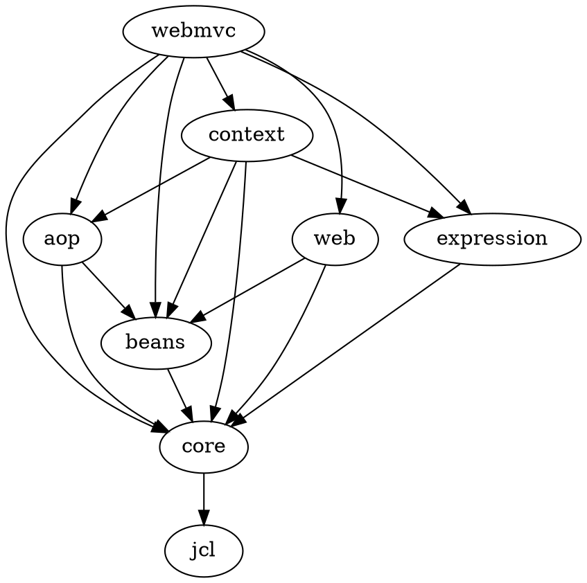

## web-mvc模块

| 模块 | 说明 |
| ---- | ---- |
| jcl | 日志适配 |
| core | 工具类、字节码操作(asm, cglib)、lang注解、实例化框架objenesis |
| beans | 操作JavaBeans相关的接口和类 |
| aop | Spring-AOP相关 |
| expression | Spring表达式语言SpEL（Spring Expression Language） |
| context | Spring上下文相关 |
| web | 提供web相关支持，如HTTP集成，远程调用，Servlet相关
| webmvc | 基于Servlet规范的Spring MVC框架 |

## 参考资料
《Expert One-on-One J2EE Design and Development》
[Java中动态规则的实现方式](https://zhuanlan.zhihu.com/p/256299423)
[Spring表达式语言](http://ifeve.com/spring-6-spel/)