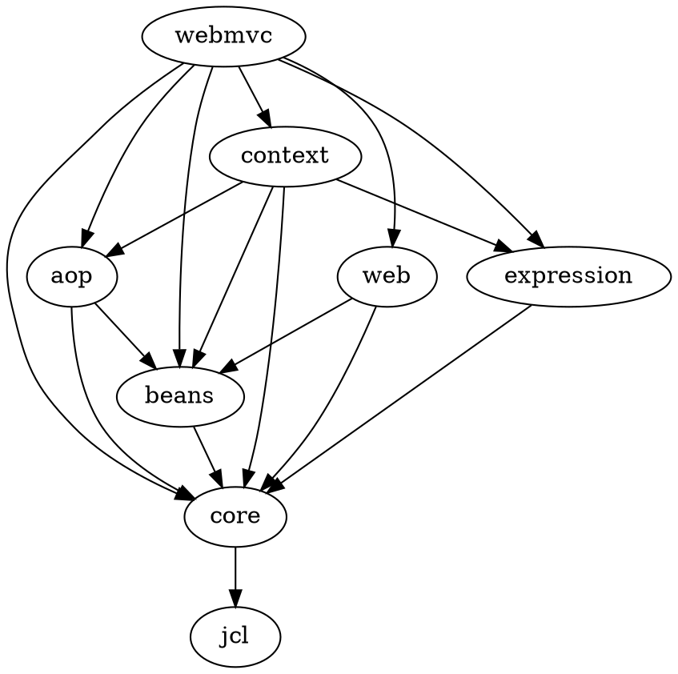

## Autowired与Resource
@Autowired注解是按照类型（byType）装配依赖对象，默认情况下它要求依赖对象必须存在，如果允许null值，可以设置它的required属性为false。
如果我们想使用按照名称（byName）来装配，可以结合@Qualifier注解一起使用。
(通过类型匹配找到多个candidate,在没有@Qualifier、@Primary注解的情况下，会使用对象名作为最后的fallback匹配)

@Resource默认按照ByName自动注入，由J2EE提供，需要导入包javax.annotation.Resource。
@Resource有两个重要的属性：name和type，而Spring将@Resource注解的name属性解析为bean的名字，而type属性则解析为bean的类型。
所以，如果使用name属性，则使用byName的自动注入策略，而使用type属性时则使用byType自动注入策略。
如果既不制定name也不制定type属性，这时将通过反射机制使用byName自动注入策略。
①如果同时指定了name和type，则从Spring上下文中找到唯一匹配的bean进行装配，找不到则抛出异常。
②如果指定了name，则从上下文中查找名称（id）匹配的bean进行装配，找不到则抛出异常。
③如果指定了type，则从上下文中找到类似匹配的唯一bean进行装配，找不到或是找到多个，都会抛出异常。
④如果既没有指定name，又没有指定type，则自动按照byName方式进行装配；如果没有匹配，则回退为一个原始类型进行匹配，如果匹配则自动装配。

## Spring如何解决循环依赖
1. 执行构造方法与设置属性分开
2. 设置属性时递归处理

## web-mvc模块

| 模块 | 说明 |
| ---- | ---- |
| jcl | 日志适配 |
| core | 工具类、字节码操作(asm, cglib)、lang注解、实例化框架objenesis |
| beans | 操作JavaBeans相关的接口和类 |
| aop | Spring-AOP相关 |
| expression | Spring表达式语言SpEL（Spring Expression Language） |
| context | Spring上下文相关 |
| web | 提供web相关支持，如HTTP集成，远程调用，Servlet相关
| webmvc | 基于Servlet规范的Spring MVC框架 |

## 参考资料
《Expert One-on-One J2EE Design and Development》
[Java中动态规则的实现方式](https://zhuanlan.zhihu.com/p/256299423)
[Spring表达式语言](http://ifeve.com/spring-6-spel/)