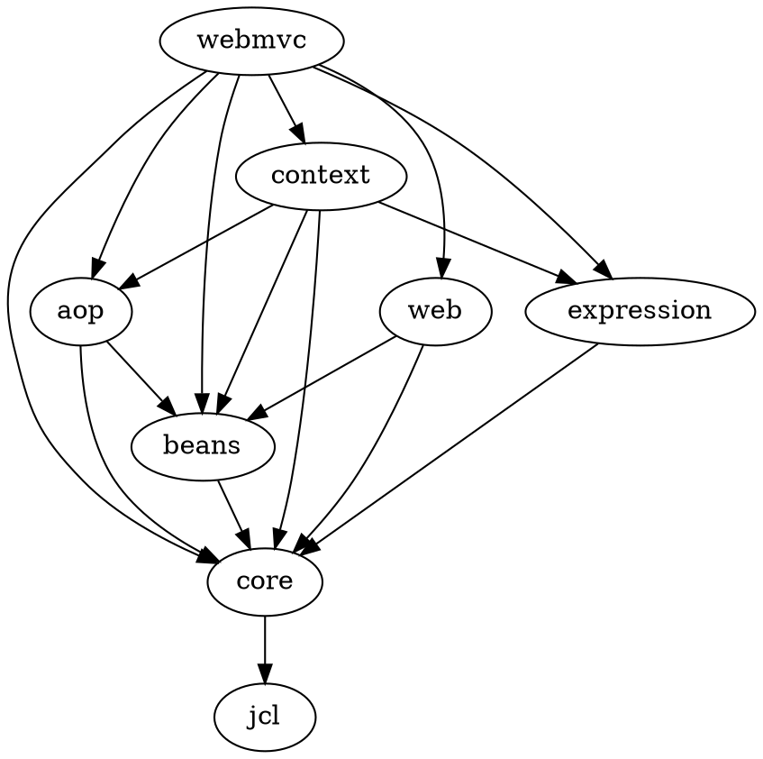

## web-mvc模块

| 模块 | 说明 |
| ---- | ---- |
| jcl | 日志适配 |
| core | 工具类、字节码操作(asm, cglib)、lang注解、实例化框架objenesis |
| beans | Spring容器相关规范定义 |
| aop | Spring-AOP相关 |
| expression | Spring表达式语言SpEL（Spring Expression Language） |
| context | Spring上下文相关 |
| web | 提供web相关支持，如HTTP集成，远程调用，Servlet相关 |
| webmvc | 基于Servlet规范的Spring MVC框架 |